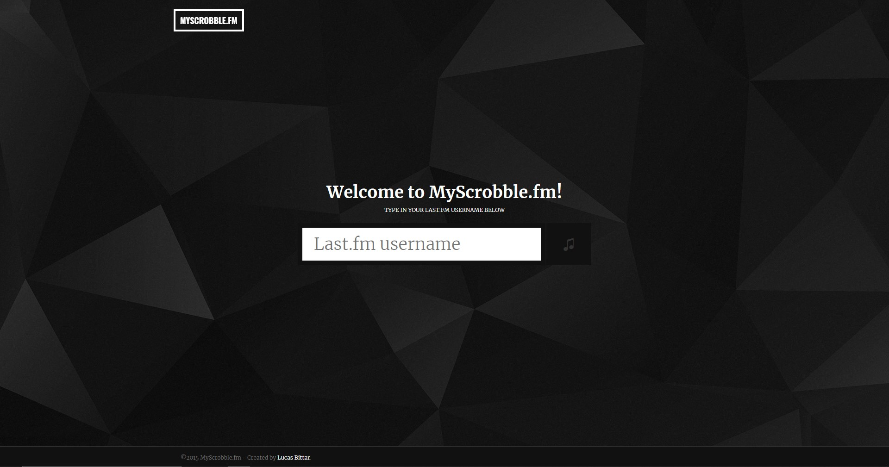
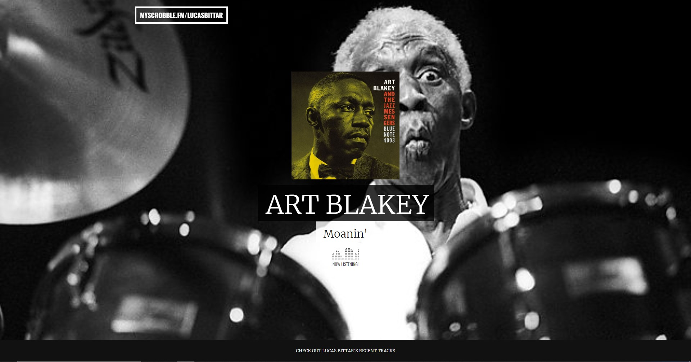

# myscrobble.fm #
MyScrobble.FM is my GA's Front-End Web Development course final project.

<h1 align="center"></h1>
<h1 align="center"></h1>

### Description ###
Based on a Lasf.fm username the app creates a full detailed one page site containing things like:

* Featured last scrobbled song (with "on tour" status)
* Top listened songs (fetching all details including artwork)
* Suggests new releases based on the user's information

### Project link ###
You can use my lasf.fm username if you don't have one: lucasbittar

[Launch Project]

[Launch Project]: https://lucasbittar.github.io/myscrobble "MyScrobble.fm"
